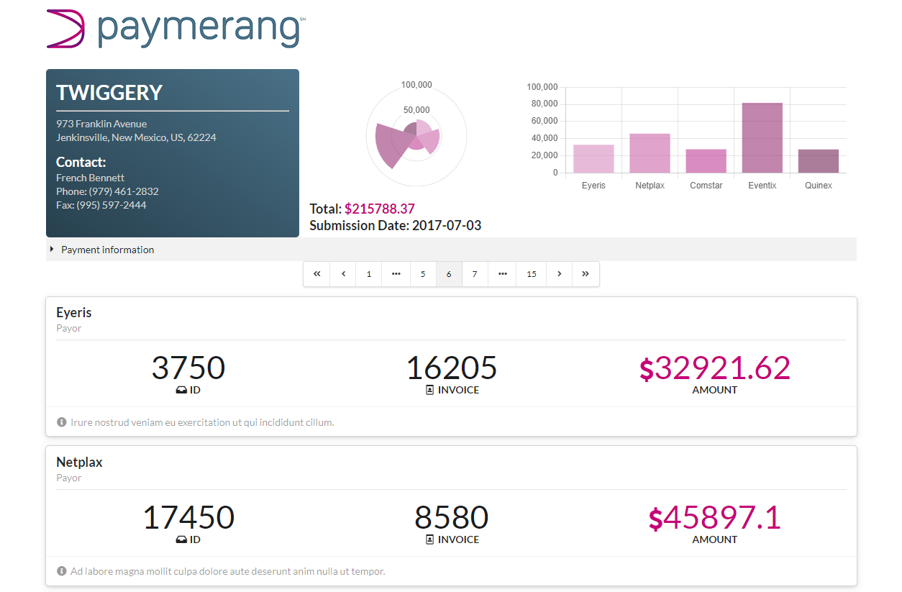

###### **ooo**

 

#### **Technical Test - Paymerang Entry Level Software Developer** 

---

## **Table of Contents**

1. [Description](#Description)
1. [Tech](#Tech)
1. [Installation](#Installation)
1. [Usage](#Usage)
1. [Notes](#Notes)
1. [Screenshots](#Screenshots)
1. [Contact](#Contact)

---

## **Description**

Greetings and salutations! Thank you for taking the time to review my technical test submission. I cannot wait to get your feedback, suggestions, and constructive criticism! I believe that is one of the best ways to learn and improve. Here is a link to the deployed site: [Technical Test](https://ecstatic-jepsen-96302a.netlify.app/)   

For this test, I decided to use `create-react-app` as my starter toolchain. I created a `single page` site that takes the provided blob of JSON data and presents it to the user in a more consumable fashion. I wanted to give the UI a `dashboard` look and feel. All of the `payees` are presented in a `paginated` format. There are animated charts that offer a quick view and some `mouse over` data. The `payment information` element is an accordion that allows the user to toggle visibility of that information. The `payor` list shows the critical data prominently. If you want a sneak peek, you can jump to the [Screenshots](#Screenshots) section to see what I put together.

Again, thank you so much for taking the time to look over my work. If you have any questions, do not hesitate to contact me! Take care!

##### [Top](#ooo)
---

## **Tech**

- React.js
- Semantic UI
- chart.js

##### [Top](#ooo)
---

## **Installation**

1. Clone the repo: `git clone https://github.com/Bertodemus/Remittance-TE.git`
1. Navigate to the test folder: `cd Remittance-TE/`
1. Install NPM packages: `npm install`

##### [Top](#ooo)
---

## **Usage**

1. Run the app: `npm start`
1. In your browser, navigate to: `http://localhost:3000/`

##### [Top](#ooo)
---

## **Notes**

Even though I completed the task that was asked of me, there is still room for improvement! As part of future development and other considerations, I have a small list of items that I would want to add and/or improve.
- Add: Search bar with a drop down that will let you quickly choose a Payee
- Refactor: There is room to dry out my code and to streamline certain elements
- Validation: Create unit tests and make more considerations for validation of data/form entry (validate search bar entry, validate JSON data is as expected, etc.)
- Review: Review some design patterns and look for ways to improve consistency of logic and structure

##### [Top](#ooo)
---

## **Screenshots**

Screenshot of the page

Screenshot of the page @500px wide

##### [Top](#ooo)
---

## **Contact**

Below is my contact information. Do not hesitate to reach out to me if you have any questions.

|                | Email                    | Portfolio                                                   | Artwork                                       |
| -------------- | ------------------------ | ------------------------------------------------------------| --------------------------------------------- |
| Roberto Rubet  | roberto@robertorubet.com | [berto.netlify.app/about](https://berto.netlify.app/about)  | [BERTO!](https://www.robertorubet.com/)       |

##### [Top](#ooo)
---

### Thank you so much for taking the time to review my work!
